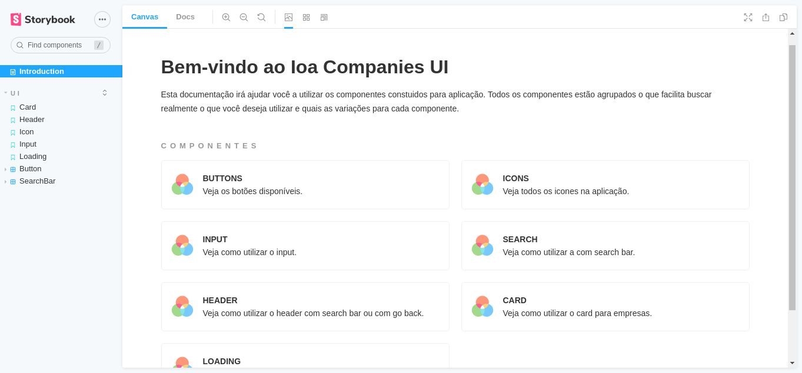

<div align="center">
  
  <div>
    An application to search for companies
  </div>
</div>

## Tools and technologies

- React.js
- Redux
- Redux Thunk (for simple asynchronous calls)
- React Router
- Styled Components
- Axios (for HTTP calls)
- Storybook (for component documentation)
- Eslint + Prettier (Linter and Code Formatter)

### Why did I use Redux Thunk?

I decided to implement the search bar debounce because I didn't want to use redux saga just for that, so I was able to use a simpler library for asynchronous calls.

## Running project

First install the dependencies:

```bash
npm i      #or npm install
```

Then run the project

```bash
npm start
```

## Component documentation


<br />
Run the command

```bash
npm run storybook
```
